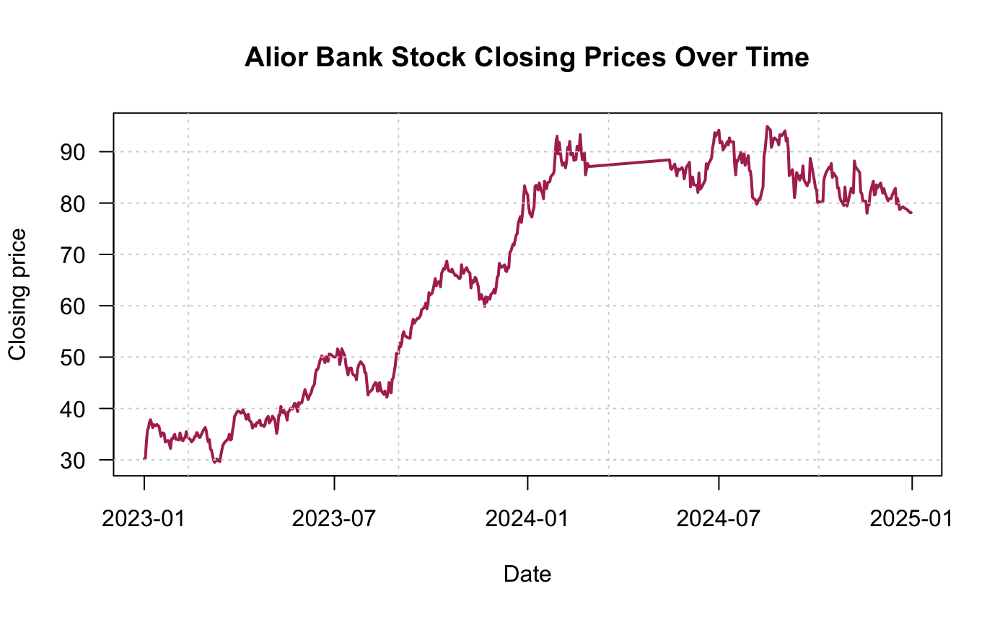
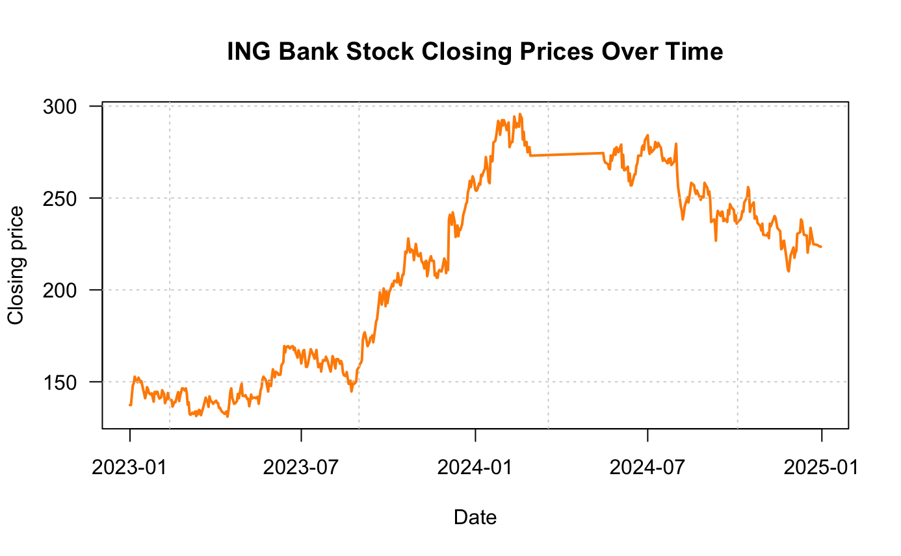
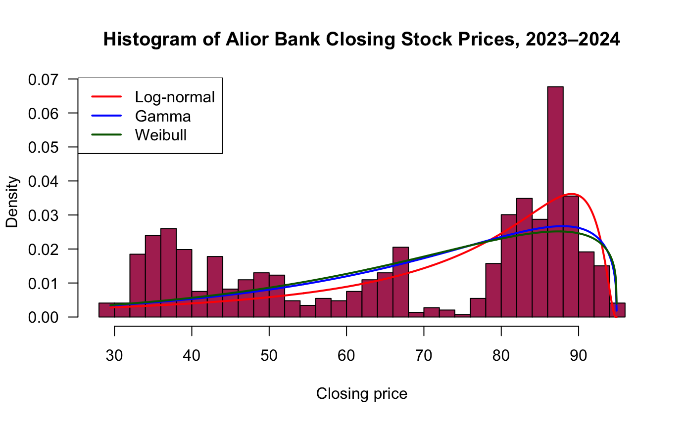
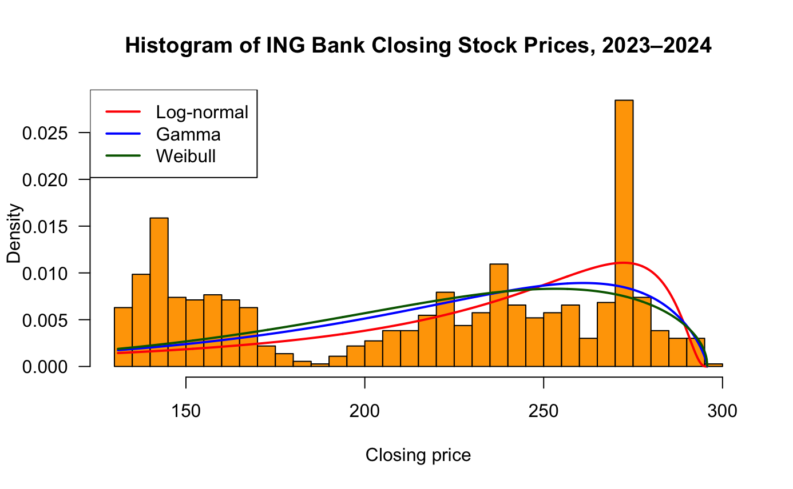
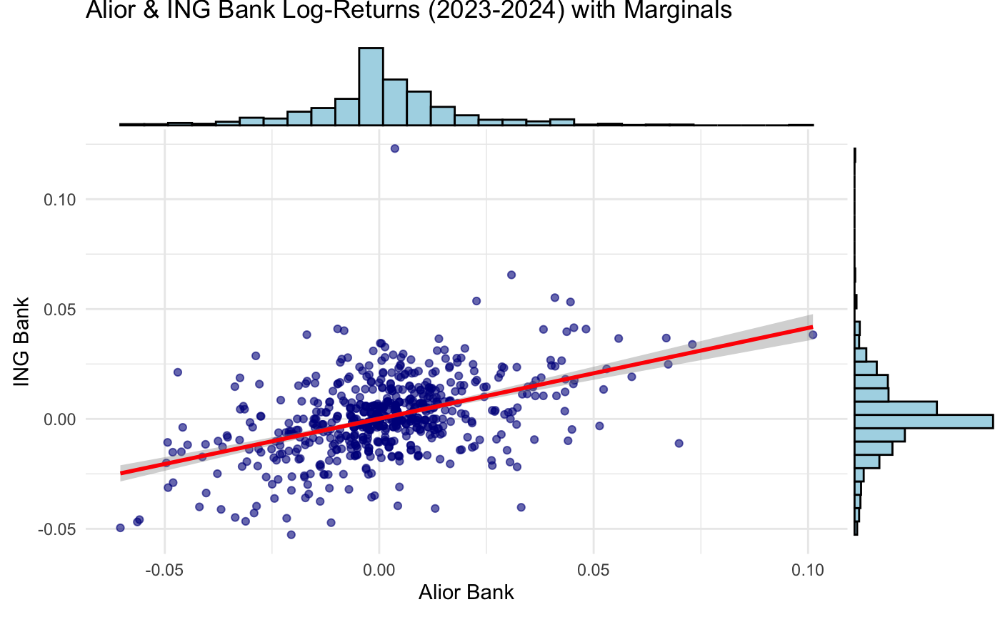
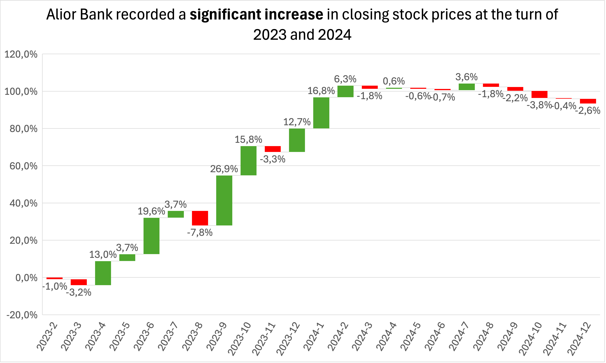
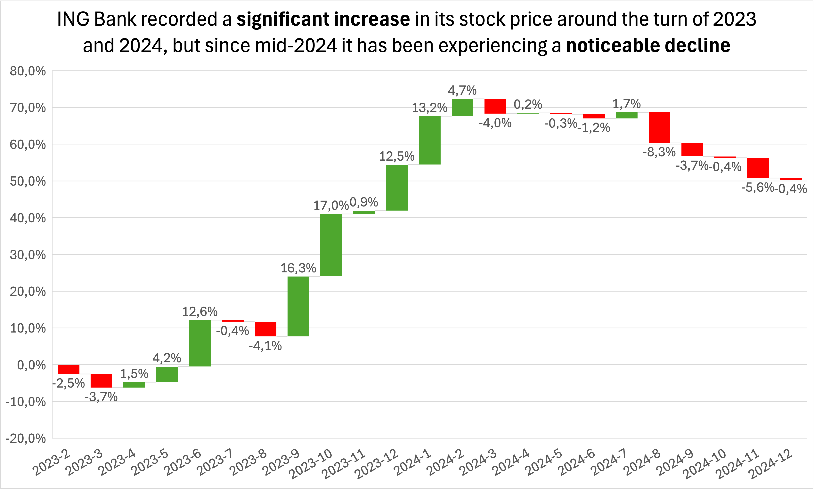

# 📊 Alior & ING Bank Stock Closing Price Analysis with MS Excel and R

### 💡 Idea of the Project

During my undergraduate studies, I took a course in statistics. Although I had excellent instructors, I often struggled to understand the practical purpose of the concepts we were learning and how the statistical methods I applied would be used in real-world contexts. At the time, I didn’t fully grasp the meaning behind the statistics I was calculating.

It was only after completing the course that I realized my interest in pursuing a career in Data Science. Through completing DataCamp courses and studying materials from the StatQuest channel, I was able to connect theoretical knowledge into a coherent framework.

However, this was still mostly theoretical, so I decided to revisit and expand a project from the statistics course, this time with a clear understanding of the concepts involved. The goal of this project is to consolidate my knowledge from my studies, online courses, and educational videos, applying it in a practical and meaningful way.

### ❗ Problem Statement

This project addresses the challenge of understanding the behavior of Alior and ING bank stock data, focusing on both single-variable and joint analyses. The primary problem is to identify the most appropriate continuous distribution models for the closing prices of each stock and to interpret the resulting statistical characteristics. At the same time, the project examines the relationships between stock returns through covariance and correlation analysis, exploring the joint distribution in a two-dimensional context. Another key challenge is to apply linear regression to model the joint behavior of the returns and to rigorously validate the model’s performance. The ultimate goal is to uncover meaningful patterns and insights from both the univariate and bivariate analyses, providing a comprehensive understanding of the dynamics of these bank stocks.

### 🗂 Source

The dataset used in this project consists of historical stock closing prices for Alior Bank and ING Bank Śląski. The data was obtained from Stooq, a reliable financial database, covering the period from January 1, 2023, to December 31, 2024. This data provides the basis for both univariate and bivariate analyses, enabling the exploration of distribution models, statistical relationships, and regression-based modeling.

- [Alior Bank](https://stooq.pl/q/d/?s=alr&c=0&f=20230101&t=20241231)

- [ING Bank Śląski](https://stooq.pl/q/d/?s=ing&c=0&f=20230101&t=20241231)

# 📑 Executive Summary

The analysis focused on the stock price dynamics of **Alior Bank** and **ING Bank** in the years 2023–2024. Special attention was paid to data quality, distribution fitting, and interdependence between the two institutions. The main findings are summarized below.

### Data Preparation

The dataset contained a significant number of missing values in the closing prices of both banks. Ignoring these gaps could have distorted the analysis, while simple replacement with existing values would have biased the results. To address this, **linear interpolation** was applied, providing a more reliable reconstruction of missing data.

### Stock Price Trends

The time series plots revealed a clear upward trend between **Q4 2023 and Q1 2024**, followed by a more linear pattern from Q2 2024 onward. This development is consistent with macroeconomic conditions of that period. Notably, ING experienced a sharper decline compared to Alior Bank.

📊 **Visualizations**  
- Closing prices of Alior Bank  
    

- Closing prices of ING Bank  
    

### Distribution Fitting

Tests of conformity between empirical distributions of log-returns and theoretical distributions (log-normal, gamma, and Weibull) indicated that:  

- **Alior Bank** best fit the **log-normal distribution**  
- **ING Bank** best fit the **gamma distribution**  

However, in all cases the *p-values* were below 5%, requiring rejection of the null hypothesis. The main source of mismatch was the **left tail**, which contained higher values not adequately captured by the models.  

📊 **Visualizations**  
- Alior Bank – empirical vs. theoretical distributions  
    

- ING Bank – empirical vs. theoretical distributions  
    

### Interdependence Between Banks

The joint distribution of log-returns suggested a moderate relationship between the two banks. This was confirmed by regression analysis with  
$ R^2 \approx 21.5\% $. Although there is some dependence, the relationship is too weak to conclude that one stock reliably explains the other. External factors likely play a significant role.  

📊 **Visualizations**  
- Joint distribution of log-returns with marginals and regression line  
    

### Value of the Project

This project enabled the application of **statistical theory** to a real-world financial dataset. It highlighted the challenges of handling missing data, the difficulty of accurately fitting distributions, and the limitations of simple models in explaining market behavior. Importantly, it also strengthened my practical skills in **Excel** and **R**, bridging theoretical concepts with applied financial data analysis.

---

### Appendix: Additional Visualizations

- Waterfall chart – Alior Bank  
    

- Waterfall chart – ING Bank  
    
