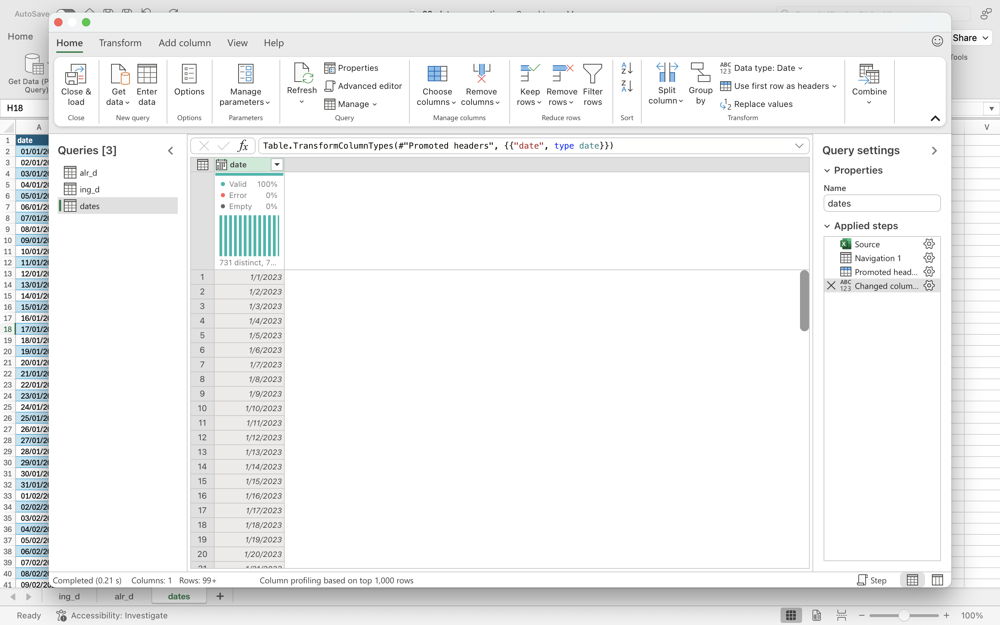

## Data Loading

Using **PowerQuery**, I imported the data from a CSV file. After analyzing the column descriptions, I confirmed that none of them contained errors or missing values. However, I quickly noticed that the dataset includes **missing days** — some dates are absent from the data. Interestingly, in both datasets (`alr_d`, `ing_d`), the missing days are exactly the same.

  


## Missing Data Analysis

I checked what percentage of the entire dataset is made up of missing days. If it were less than 5%, they could have been omitted. However, in our case, the missing data accounts for as much as **32%**, so ignoring them could distort the entire distribution analysis.

  


## Data Preparation

The table with the required data was saved to a CSV file. Then, in **VSCode**, I replaced commas `,` with dots `.` (`06_change_comma_to_dot`), because Excel in my region saves numbers with a comma as the decimal separator.  


## Linear Interpolation of Missing Values

The next step is to perform **linear interpolation** of the missing data.  

### Definition of Linear Interpolation

Linear interpolation is a method to estimate missing values by assuming a linear change between two known points.  

Mathematically, if a value \(y\) at position \(x\) is missing between two known points \((x_0, y_0)\) and \((x_1, y_1)\), it is computed as:

\[
y = y_0 + \frac{y_1 - y_0}{x_1 - x_0} \cdot (x - x_0)
\]

#### Example

Consider the dataset:

\[
x = (3, 7, \text{NA}, 5, 8, \text{NA}, \text{NA}, 11)
\]

1. The first missing value (`NA`) is between 7 (position 2) and 5 (position 4). Using the formula:

\[
y = 7 + \frac{5 - 7}{4 - 2} \cdot (3 - 2) = 7 + (-1) = 6
\]

2. The second missing value (`NA`) is between 8 (position 5) and 11 (position 8). Since there are **two consecutive NAs**, we interpolate them linearly:

- Position 6: 

\[
y = 8 + \frac{11 - 8}{8 - 5} \cdot (6 - 5) = 8 + 1 = 9
\]

- Position 7: 

\[
y = 8 + \frac{11 - 8}{8 - 5} \cdot (7 - 5) = 8 + 2 = 10
\]

After linear interpolation, the completed dataset becomes:

\[
x = (3, 7, 6, 5, 8, 9, 10, 11)
\]

### Loading Data

I load the data into R and split it into the appropriate columns:

```{r}
data <- read.csv(
  file = "data.csv",
  header = TRUE,
  sep = ";"
)
```

```{r}
data
```

```{r}
data_dates <- data$date
data_alior <- data$close_alr
data_ing <- data$close_ing
```

### Using Build-In Functions

I use the `approx` function in R for linear interpolation.

The `approx` function works as follows:

- It takes a vector of known points:
  - `x`: representing indexes of non-empty values,
  - `y`: representing values at indexes at `x`.

- It computes values at target points (`xout`) through **linear interpolation**, i.e., it determines a point on the line connecting two neighboring known points.  

- The parameter `rule = 2` ensures that values outside the range of known points are **extrapolated** instead of returning NA.  

Below is my custom function that fills in the missing values:


```{r}
linear_interpolation <- function(data) {
  na_indexes <- c()
  no_na_indexes <- c()
  no_na_values <- c()
  for (i in 1:length(data)) {
    if (is.na(data[i])) {
      na_indexes <- c(na_indexes, i)
    } else {
      no_na_indexes <- c(no_na_indexes, i)
      no_na_values <- c(no_na_values, data[i])
    }
  }
  
  interpolated_data <- approx(
    x = no_na_indexes,
    y = no_na_values,
    xout = na_indexes,
    rule = 2
  )
  
  response <- data
  response[na_indexes] <- interpolated_data$y
  
  return(response)
}
```

I perform the interpolation separately for each column:

```{r}
data_alior_int <- linear_interpolation(data_alior)
data_ing_int <- linear_interpolation(data_ing)
```

### Saving the interpolated data

I save the interpolated data into a CSV file so that it can be used for further analysis:

```{r}
new_data <- data.frame(
  date = data_dates,
  closes_alior = data_alior_int,
  closes_ing = data_ing_int
)

write.csv(
  x = new_data,
  file = "int_data.csv",
  row.names = FALSE
)
```

```{r}
new_data
```

## Summary

Thanks to this step, the dataset is now complete, and the missing values have been filled using linear interpolation.  
This ensures that the data is ready for further analysis of the closing price distributions.
