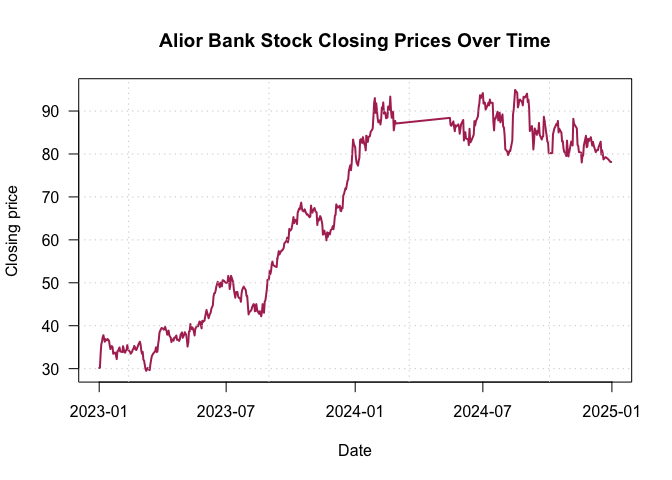
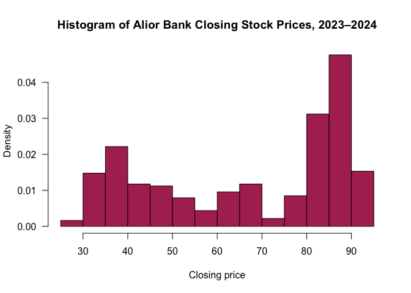
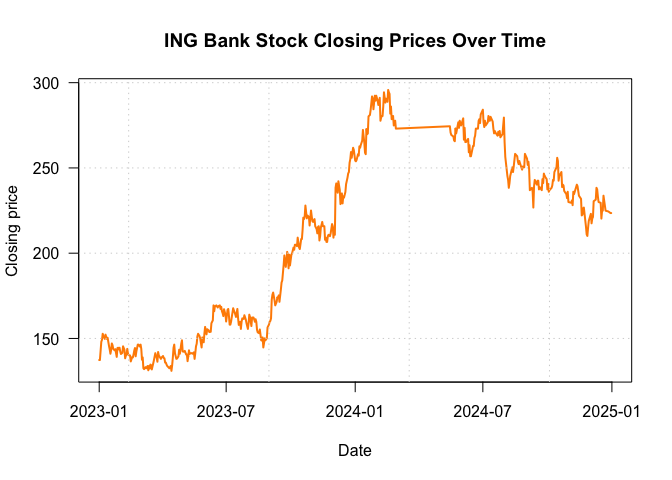
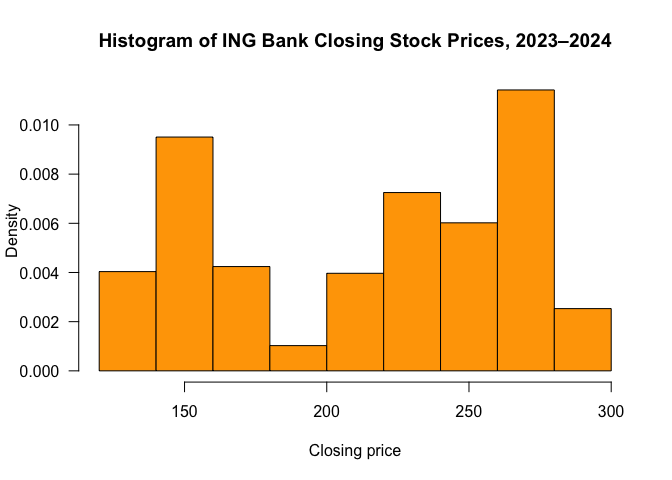
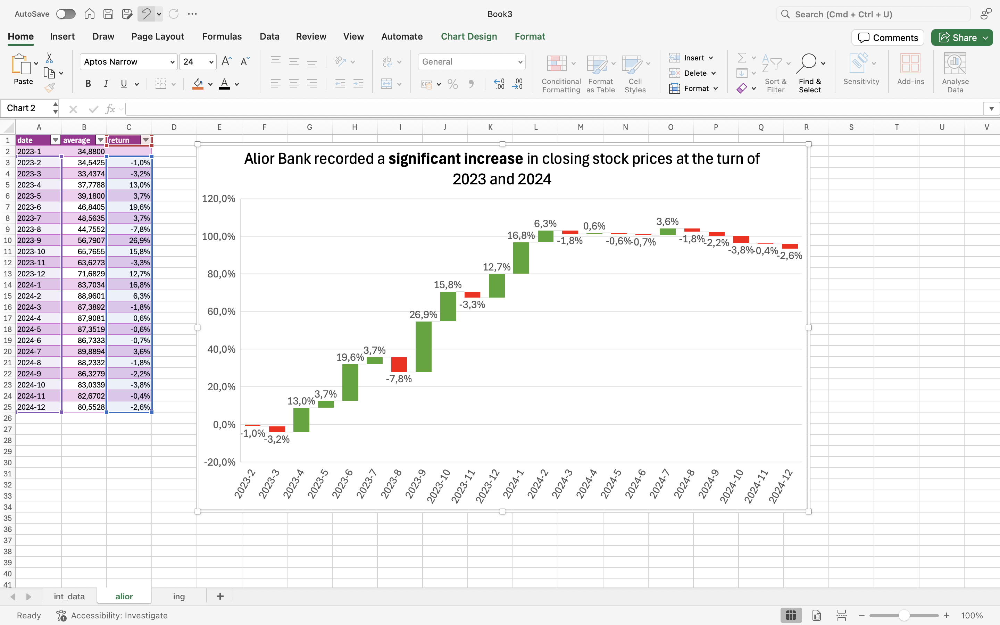
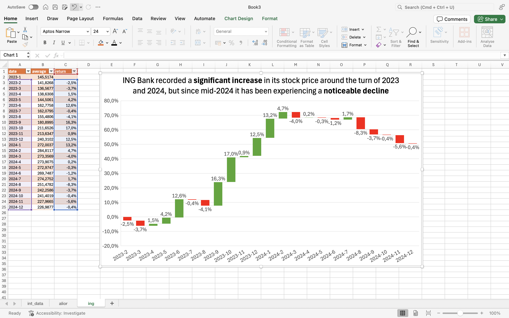

    data <- read.csv("../02_data_preparation/int_data.csv")

    data

    ##           date closes_alior closes_ing
    ## 1   2023-01-01     30.16000   137.3500
    ## 2   2023-01-02     30.16000   137.3500
    ## 3   2023-01-03     33.37000   142.7100
    ## 4   2023-01-04     35.68000   148.0600
    ## 5   2023-01-05     36.27000   149.2300
    ## 6   2023-01-06     37.34000   152.7400
    ## 7   2023-01-07     37.80000   151.4100
    ## 8   2023-01-08     37.03000   150.5700
    ## 9   2023-01-09     36.26000   149.7300
    ## 10  2023-01-10     36.87000   152.2400
    ## 11  2023-01-11     36.73000   150.9850
    ## 12  2023-01-12     36.59000   149.7300
    ## 13  2023-01-13     36.89000   150.4000
    ## 14  2023-01-14     36.70000   147.9750
    ## 15  2023-01-15     36.51000   145.5500
    ## 16  2023-01-16     35.42000   143.5400
    ## 17  2023-01-17     34.56000   141.0300
    ## 18  2023-01-18     35.22000   143.2100
    ## 19  2023-01-19     35.24000   147.0600
    ## 20  2023-01-20     35.04000   146.0500
    ## 21  2023-01-21     33.46000   143.8800
    ## 22  2023-01-22     33.59500   143.4600
    ## 23  2023-01-23     33.73000   143.0400
    ## 24  2023-01-24     33.73000   143.7100
    ## 25  2023-01-25     32.97500   141.4500
    ## 26  2023-01-26     32.22000   139.1900
    ## 27  2023-01-27     34.07000   144.3800
    ## 28  2023-01-28     34.12000   144.5500
    ## 29  2023-01-29     34.61000   143.5400
    ## 30  2023-01-30     34.94000   144.5500
    ## 31  2023-01-31     33.99000   142.3700
    ## 32  2023-02-01     33.98000   140.8700
    ## 33  2023-02-02     33.91500   141.2050
    ## 34  2023-02-03     33.85000   141.5400
    ## 35  2023-02-04     35.23000   145.3800
    ## 36  2023-02-05     34.51000   144.3800
    ## 37  2023-02-06     33.79000   143.3800
    ## 38  2023-02-07     33.73000   138.3600
    ## 39  2023-02-08     34.22000   139.8600
    ## 40  2023-02-09     34.35000   140.5300
    ## 41  2023-02-10     35.47000   143.8800
    ## 42  2023-02-11     34.63000   141.2000
    ## 43  2023-02-12     34.30000   140.2000
    ## 44  2023-02-13     34.10000   140.1150
    ## 45  2023-02-14     33.90000   140.0300
    ## 46  2023-02-15     33.47000   136.5200
    ## 47  2023-02-16     33.71500   137.7750
    ## 48  2023-02-17     33.96000   139.0300
    ## 49  2023-02-18     34.53000   138.8600
    ## 50  2023-02-19     34.61000   140.7000
    ## 51  2023-02-20     35.30000   142.8700
    ## 52  2023-02-21     34.99000   144.3800
    ## 53  2023-02-22     34.42000   139.5300
    ## 54  2023-02-23     34.34000   142.3700
    ## 55  2023-02-24     34.76500   144.3800
    ## 56  2023-02-25     35.19000   146.3900
    ## 57  2023-02-26     35.66000   146.3900
    ## 58  2023-02-27     35.97500   145.8050
    ## 59  2023-02-28     36.29000   145.2200
    ## 60  2023-03-01     35.64000   146.3900
    ## 61  2023-03-02     34.20000   143.8800
    ## 62  2023-03-03     33.47000   137.5200
    ## 63  2023-03-04     33.92000   138.8600
    ## 64  2023-03-05     32.06000   132.5000
    ## 65  2023-03-06     31.87000   132.0000
    ## 66  2023-03-07     30.88500   132.5850
    ## 67  2023-03-08     29.90000   133.1700
    ## 68  2023-03-09     29.49000   132.5000
    ## 69  2023-03-10     29.82500   133.1700
    ## 70  2023-03-11     30.16000   133.8400
    ## 71  2023-03-12     29.81000   131.3300
    ## 72  2023-03-13     29.96000   133.8400
    ## 73  2023-03-14     29.65000   132.3300
    ## 74  2023-03-15     31.03000   134.6800
    ## 75  2023-03-16     32.04000   134.3400
    ## 76  2023-03-17     32.89000   131.8300
    ## 77  2023-03-18     33.21000   133.5850
    ## 78  2023-03-19     33.53000   135.3400
    ## 79  2023-03-20     33.68000   137.1900
    ## 80  2023-03-21     33.92000   139.2800
    ## 81  2023-03-22     34.16000   141.3700
    ## 82  2023-03-23     34.97000   140.0300
    ## 83  2023-03-24     33.85000   138.6900
    ## 84  2023-03-25     34.01000   136.3500
    ## 85  2023-03-26     35.69000   142.0400
    ## 86  2023-03-27     36.77000   140.0300
    ## 87  2023-03-28     38.46000   139.3600
    ## 88  2023-03-29     38.83000   138.6900
    ## 89  2023-03-30     39.20000   138.0200
    ## 90  2023-03-31     39.48000   138.8600
    ## 91  2023-04-01     39.40500   139.2800
    ## 92  2023-04-02     39.33000   139.7000
    ## 93  2023-04-03     39.07000   138.5200
    ## 94  2023-04-04     39.19000   138.3600
    ## 95  2023-04-05     39.75000   135.8500
    ## 96  2023-04-06     39.15000   135.8500
    ## 97  2023-04-07     38.80000   134.6800
    ## 98  2023-04-08     37.90000   133.8400
    ## 99  2023-04-09     38.38000   133.4200
    ## 100 2023-04-10     38.86000   133.0000
    ## 101 2023-04-11     37.73000   132.5000
    ## 102 2023-04-12     37.48000   133.1700
    ## 103 2023-04-13     37.23000   133.8400
    ## 104 2023-04-14     36.19000   131.0000
    ## 105 2023-04-15     36.79000   134.1700
    ## 106 2023-04-16     36.81000   138.8600
    ## 107 2023-04-17     36.51000   144.5500
    ## 108 2023-04-18     37.22000   146.3900
    ## 109 2023-04-19     37.18000   141.3700
    ## 110 2023-04-20     37.45500   139.6950
    ## 111 2023-04-21     37.73000   138.0200
    ## 112 2023-04-22     36.70000   138.1900
    ## 113 2023-04-23     36.73500   138.8600
    ## 114 2023-04-24     36.77000   139.5300
    ## 115 2023-04-25     36.45000   143.3800
    ## 116 2023-04-26     36.86000   141.0300
    ## 117 2023-04-27     37.90000   143.7100
    ## 118 2023-04-28     38.16000   146.8900
    ## 119 2023-04-29     38.45000   148.9000
    ## 120 2023-04-30     37.18000   142.3700
    ## 121 2023-05-01     37.51000   142.2850
    ## 122 2023-05-02     37.84000   142.2000
    ## 123 2023-05-03     38.49000   142.7100
    ## 124 2023-05-04     38.19500   141.6200
    ## 125 2023-05-05     37.90000   140.5300
    ## 126 2023-05-06     36.87000   140.7000
    ## 127 2023-05-07     35.14000   136.6800
    ## 128 2023-05-08     36.15000   139.5300
    ## 129 2023-05-09     38.67000   143.0400
    ## 130 2023-05-10     38.67000   140.8700
    ## 131 2023-05-11     40.38000   141.3700
    ## 132 2023-05-12     39.79000   141.3700
    ## 133 2023-05-13     39.20000   141.3700
    ## 134 2023-05-14     39.60000   141.0300
    ## 135 2023-05-15     39.11500   141.4500
    ## 136 2023-05-16     38.63000   141.8700
    ## 137 2023-05-17     37.73000   138.0200
    ## 138 2023-05-18     39.31000   141.3700
    ## 139 2023-05-19     39.51000   145.3800
    ## 140 2023-05-20     39.92000   146.8900
    ## 141 2023-05-21     40.05000   151.2400
    ## 142 2023-05-22     39.87000   152.7400
    ## 143 2023-05-23     40.42500   152.0750
    ## 144 2023-05-24     40.98000   151.4100
    ## 145 2023-05-25     40.87000   150.0700
    ## 146 2023-05-26     40.12500   147.3900
    ## 147 2023-05-27     39.38000   144.7100
    ## 148 2023-05-28     41.14000   150.5700
    ## 149 2023-05-29     40.87000   148.5600
    ## 150 2023-05-30     41.12000   147.7300
    ## 151 2023-05-31     41.13000   152.9100
    ## 152 2023-06-01     42.04000   156.7600
    ## 153 2023-06-02     42.85500   154.5850
    ## 154 2023-06-03     43.67000   152.4100
    ## 155 2023-06-04     43.03000   155.4200
    ## 156 2023-06-05     42.38000   155.0850
    ## 157 2023-06-06     41.73000   154.7500
    ## 158 2023-06-07     42.35000   153.7500
    ## 159 2023-06-08     42.73500   153.8300
    ## 160 2023-06-09     43.12000   153.9100
    ## 161 2023-06-10     43.99000   158.9300
    ## 162 2023-06-11     44.36000   159.7700
    ## 163 2023-06-12     44.73000   160.6100
    ## 164 2023-06-13     46.77000   169.3900
    ## 165 2023-06-14     47.55000   165.9600
    ## 166 2023-06-15     47.57000   168.9700
    ## 167 2023-06-16     48.18000   168.9700
    ## 168 2023-06-17     49.11000   169.3900
    ## 169 2023-06-18     49.67500   168.7650
    ## 170 2023-06-19     50.24000   168.1400
    ## 171 2023-06-20     49.90000   168.9700
    ## 172 2023-06-21     49.42000   169.1800
    ## 173 2023-06-22     48.94000   169.3900
    ## 174 2023-06-23     50.04000   167.3000
    ## 175 2023-06-24     49.72000   168.5500
    ## 176 2023-06-25     49.17000   165.9600
    ## 177 2023-06-26     50.59000   164.7900
    ## 178 2023-06-27     50.57000   163.1200
    ## 179 2023-06-28     50.45000   167.1300
    ## 180 2023-06-29     50.26000   165.5400
    ## 181 2023-06-30     50.07000   163.9500
    ## 182 2023-07-01     49.98000   159.9400
    ## 183 2023-07-02     50.02500   163.3700
    ## 184 2023-07-03     50.07000   166.8000
    ## 185 2023-07-04     51.60000   167.3000
    ## 186 2023-07-05     50.99000   163.1200
    ## 187 2023-07-06     48.54000   158.1000
    ## 188 2023-07-07     49.53000   158.1000
    ## 189 2023-07-08     51.62000   159.7700
    ## 190 2023-07-09     51.15000   162.4500
    ## 191 2023-07-10     50.66000   165.0850
    ## 192 2023-07-11     50.17000   167.7200
    ## 193 2023-07-12     48.42000   166.4600
    ## 194 2023-07-13     47.47000   165.2900
    ## 195 2023-07-14     46.52000   164.1200
    ## 196 2023-07-15     47.81000   162.6100
    ## 197 2023-07-16     47.84500   164.9550
    ## 198 2023-07-17     47.88000   167.3000
    ## 199 2023-07-18     46.91000   161.9500
    ## 200 2023-07-19     46.52000   157.9300
    ## 201 2023-07-20     46.44500   158.8500
    ## 202 2023-07-21     46.37000   159.7700
    ## 203 2023-07-22     45.57000   155.5900
    ## 204 2023-07-23     47.55000   159.7700
    ## 205 2023-07-24     48.40000   161.7800
    ## 206 2023-07-25     48.75500   161.6100
    ## 207 2023-07-26     49.11000   161.4400
    ## 208 2023-07-27     48.84000   163.6200
    ## 209 2023-07-28     48.56000   162.3650
    ## 210 2023-07-29     48.28000   161.1100
    ## 211 2023-07-30     46.94000   158.9300
    ## 212 2023-07-31     46.94000   157.2600
    ## 213 2023-08-01     44.68000   155.5900
    ## 214 2023-08-02     42.63000   158.9300
    ## 215 2023-08-03     43.21000   163.9500
    ## 216 2023-08-04     43.27000   162.6100
    ## 217 2023-08-05     43.46500   159.9350
    ## 218 2023-08-06     43.66000   157.2600
    ## 219 2023-08-07     44.33000   162.2800
    ## 220 2023-08-08     44.68000   162.2800
    ## 221 2023-08-09     45.03000   162.2800
    ## 222 2023-08-10     44.91000   161.1100
    ## 223 2023-08-11     43.35000   159.7700
    ## 224 2023-08-12     43.43000   161.2800
    ## 225 2023-08-13     45.03000   159.7700
    ## 226 2023-08-14     43.92000   155.0900
    ## 227 2023-08-15     43.31000   153.5800
    ## 228 2023-08-16     43.04000   153.3300
    ## 229 2023-08-17     42.77000   153.0800
    ## 230 2023-08-18     43.38000   155.2500
    ## 231 2023-08-19     42.79000   152.0750
    ## 232 2023-08-20     42.20000   148.9000
    ## 233 2023-08-21     43.12000   148.7300
    ## 234 2023-08-22     45.03000   150.5700
    ## 235 2023-08-23     43.76000   144.7100
    ## 236 2023-08-24     43.03000   147.2200
    ## 237 2023-08-25     45.64000   150.0700
    ## 238 2023-08-26     45.93000   148.9000
    ## 239 2023-08-27     47.19000   149.4850
    ## 240 2023-08-28     48.45000   150.0700
    ## 241 2023-08-29     50.70000   156.4300
    ## 242 2023-08-30     50.72500   157.2650
    ## 243 2023-08-31     50.75000   158.1000
    ## 244 2023-09-01     52.73000   159.7700
    ## 245 2023-09-02     52.02000   160.2700
    ## 246 2023-09-03     52.68000   161.7800
    ## 247 2023-09-04     54.33000   172.7400
    ## 248 2023-09-05     54.94000   175.6600
    ## 249 2023-09-06     54.16000   176.9200
    ## 250 2023-09-07     54.03000   174.6200
    ## 251 2023-09-08     53.90000   172.3200
    ## 252 2023-09-09     53.79000   169.3900
    ## 253 2023-09-10     53.73000   170.4350
    ## 254 2023-09-11     53.67000   171.4800
    ## 255 2023-09-12     55.63000   173.9900
    ## 256 2023-09-13     56.33000   173.9900
    ## 257 2023-09-14     57.37000   175.2500
    ## 258 2023-09-15     56.59000   171.4800
    ## 259 2023-09-16     56.93000   175.0350
    ## 260 2023-09-17     57.27000   178.5900
    ## 261 2023-09-18     57.53000   182.7700
    ## 262 2023-09-19     57.51000   184.0300
    ## 263 2023-09-20     57.79500   188.6300
    ## 264 2023-09-21     58.08000   193.2300
    ## 265 2023-09-22     59.20000   198.6700
    ## 266 2023-09-23     59.37500   195.3250
    ## 267 2023-09-24     59.55000   191.9800
    ## 268 2023-09-25     59.82000   195.7400
    ## 269 2023-09-26     60.52000   200.7600
    ## 270 2023-09-27     59.41000   199.0900
    ## 271 2023-09-28     60.19000   191.1400
    ## 272 2023-09-29     62.54000   199.0900
    ## 273 2023-09-30     62.10000   192.8100
    ## 274 2023-10-01     62.26500   195.9500
    ## 275 2023-10-02     62.43000   199.0900
    ## 276 2023-10-03     63.18000   199.9200
    ## 277 2023-10-04     64.24000   201.5950
    ## 278 2023-10-05     65.30000   203.2700
    ## 279 2023-10-06     63.89000   202.0100
    ## 280 2023-10-07     64.48000   204.9400
    ## 281 2023-10-08     64.66000   204.9400
    ## 282 2023-10-09     64.64000   204.9400
    ## 283 2023-10-10     63.68000   204.1000
    ## 284 2023-10-11     66.29000   209.1200
    ## 285 2023-10-12     66.78500   206.1950
    ## 286 2023-10-13     67.28000   203.2700
    ## 287 2023-10-14     67.09000   202.4300
    ## 288 2023-10-15     67.88000   205.3600
    ## 289 2023-10-16     68.67000   208.2900
    ## 290 2023-10-17     67.37000   208.2900
    ## 291 2023-10-18     66.76000   213.7200
    ## 292 2023-10-19     66.85000   220.8300
    ## 293 2023-10-20     66.59000   220.0000
    ## 294 2023-10-21     67.11000   221.6700
    ## 295 2023-10-22     66.62000   227.9400
    ## 296 2023-10-23     66.24500   224.1800
    ## 297 2023-10-24     65.87000   220.4200
    ## 298 2023-10-25     65.98000   222.0900
    ## 299 2023-10-26     65.72500   221.6700
    ## 300 2023-10-27     65.47000   221.2500
    ## 301 2023-10-28     65.27000   216.2300
    ## 302 2023-10-29     65.46000   220.8300
    ## 303 2023-10-30     67.98000   225.0200
    ## 304 2023-10-31     66.67000   221.6700
    ## 305 2023-11-01     66.33000   218.7400
    ## 306 2023-11-02     66.93000   218.3300
    ## 307 2023-11-03     67.17500   219.1650
    ## 308 2023-11-04     67.42000   220.0000
    ## 309 2023-11-05     66.76000   215.8200
    ## 310 2023-11-06     66.56000   214.9800
    ## 311 2023-11-07     66.36000   214.1400
    ## 312 2023-11-08     63.46000   211.6300
    ## 313 2023-11-09     64.92000   215.4000
    ## 314 2023-11-10     64.48000   215.8200
    ## 315 2023-11-11     64.76000   207.4500
    ## 316 2023-11-12     65.53000   209.9600
    ## 317 2023-11-13     65.23000   214.9800
    ## 318 2023-11-14     64.48500   216.6550
    ## 319 2023-11-15     63.74000   218.3300
    ## 320 2023-11-16     61.21000   215.8200
    ## 321 2023-11-17     61.68000   215.8200
    ## 322 2023-11-18     62.15000   215.8200
    ## 323 2023-11-19     61.30000   207.8700
    ## 324 2023-11-20     61.28000   209.1200
    ## 325 2023-11-21     59.88000   206.6100
    ## 326 2023-11-22     61.74000   206.6100
    ## 327 2023-11-23     60.69000   209.9600
    ## 328 2023-11-24     61.63000   210.8000
    ## 329 2023-11-25     61.45000   210.3800
    ## 330 2023-11-26     61.27000   209.9600
    ## 331 2023-11-27     62.21000   211.6300
    ## 332 2023-11-28     62.40000   214.3500
    ## 333 2023-11-29     62.59000   217.0700
    ## 334 2023-11-30     63.20000   215.8200
    ## 335 2023-12-01     62.47000   209.1200
    ## 336 2023-12-02     63.61000   214.9800
    ## 337 2023-12-03     65.58000   210.8000
    ## 338 2023-12-04     65.82000   238.4000
    ## 339 2023-12-05     68.26000   240.9100
    ## 340 2023-12-06     67.87500   238.1900
    ## 341 2023-12-07     67.49000   235.4700
    ## 342 2023-12-08     67.58000   242.1600
    ## 343 2023-12-09     67.77000   239.6550
    ## 344 2023-12-10     67.96000   237.1500
    ## 345 2023-12-11     66.80000   228.7800
    ## 346 2023-12-12     66.66000   230.0400
    ## 347 2023-12-13     67.54000   235.0600
    ## 348 2023-12-14     67.37000   229.2000
    ## 349 2023-12-15     70.36000   233.3800
    ## 350 2023-12-16     70.64000   232.5500
    ## 351 2023-12-17     71.32500   234.2200
    ## 352 2023-12-18     72.01000   235.8900
    ## 353 2023-12-19     71.80000   240.4900
    ## 354 2023-12-20     72.77500   242.3750
    ## 355 2023-12-21     73.75000   244.2600
    ## 356 2023-12-22     74.04000   246.7700
    ## 357 2023-12-23     76.06000   247.6000
    ## 358 2023-12-24     76.76000   253.0400
    ## 359 2023-12-25     77.37000   255.1300
    ## 360 2023-12-26     76.22000   259.3100
    ## 361 2023-12-27     77.89000   255.9700
    ## 362 2023-12-28     80.62500   258.8950
    ## 363 2023-12-29     83.36000   261.8200
    ## 364 2023-12-30     82.42000   260.5700
    ## 365 2023-12-31     81.98000   257.4300
    ## 366 2024-01-01     81.54000   254.2900
    ## 367 2024-01-02     79.12000   253.8800
    ## 368 2024-01-03     77.97000   254.7100
    ## 369 2024-01-04     77.62500   256.3850
    ## 370 2024-01-05     77.28000   258.0600
    ## 371 2024-01-06     78.44000   257.2200
    ## 372 2024-01-07     79.09000   262.6600
    ## 373 2024-01-08     83.26000   261.8200
    ## 374 2024-01-09     83.45000   263.5000
    ## 375 2024-01-10     83.00500   264.7550
    ## 376 2024-01-11     82.56000   266.0100
    ## 377 2024-01-12     83.92000   272.2800
    ## 378 2024-01-13     83.09500   268.5150
    ## 379 2024-01-14     82.27000   264.7500
    ## 380 2024-01-15     82.02000   258.9000
    ## 381 2024-01-16     80.84000   258.0600
    ## 382 2024-01-17     84.22000   272.7000
    ## 383 2024-01-18     82.86000   269.7700
    ## 384 2024-01-19     82.81000   270.1900
    ## 385 2024-01-20     83.97000   280.2300
    ## 386 2024-01-21     84.06000   280.6450
    ## 387 2024-01-22     84.15000   281.0600
    ## 388 2024-01-23     85.14000   283.9900
    ## 389 2024-01-24     85.38000   287.9650
    ## 390 2024-01-25     85.62000   291.9400
    ## 391 2024-01-26     85.99000   290.6800
    ## 392 2024-01-27     88.80000   284.4100
    ## 393 2024-01-28     91.93000   288.5900
    ## 394 2024-01-29     93.01000   292.3600
    ## 395 2024-01-30     89.58000   289.4300
    ## 396 2024-01-31     91.80000   292.3600
    ## 397 2024-02-01     90.08000   290.8950
    ## 398 2024-02-02     88.36000   289.4300
    ## 399 2024-02-03     87.36000   286.9200
    ## 400 2024-02-04     87.60000   289.0100
    ## 401 2024-02-05     87.84000   291.1000
    ## 402 2024-02-06     86.86000   277.6800
    ## 403 2024-02-07     88.06000   279.5300
    ## 404 2024-02-08     90.84000   280.4600
    ## 405 2024-02-09     90.32000   280.4600
    ## 406 2024-02-10     92.01000   286.0100
    ## 407 2024-02-11     89.40000   294.3400
    ## 408 2024-02-12     89.53500   291.3300
    ## 409 2024-02-13     89.67000   288.3200
    ## 410 2024-02-14     88.32000   290.6400
    ## 411 2024-02-15     88.40500   289.7150
    ## 412 2024-02-16     88.49000   288.7900
    ## 413 2024-02-17     91.06000   295.7300
    ## 414 2024-02-18     90.23000   294.3400
    ## 415 2024-02-19     90.32000   293.4100
    ## 416 2024-02-20     93.36000   281.8400
    ## 417 2024-02-21     90.27000   286.0100
    ## 418 2024-02-22     88.45000   278.6000
    ## 419 2024-02-23     89.15000   279.5300
    ## 420 2024-02-24     89.85000   280.4600
    ## 421 2024-02-25     85.50000   274.9000
    ## 422 2024-02-26     86.59500   276.2900
    ## 423 2024-02-27     87.69000   277.6800
    ## 424 2024-02-28     87.10000   273.0500
    ## 425 2024-02-29     87.11701   273.0681
    ## 426 2024-03-01     87.13403   273.0861
    ## 427 2024-03-02     87.15104   273.1042
    ## 428 2024-03-03     87.16805   273.1222
    ## 429 2024-03-04     87.18506   273.1403
    ## 430 2024-03-05     87.20208   273.1583
    ## 431 2024-03-06     87.21909   273.1764
    ## 432 2024-03-07     87.23610   273.1944
    ## 433 2024-03-08     87.25312   273.2125
    ## 434 2024-03-09     87.27013   273.2305
    ## 435 2024-03-10     87.28714   273.2486
    ## 436 2024-03-11     87.30416   273.2666
    ## 437 2024-03-12     87.32117   273.2847
    ## 438 2024-03-13     87.33818   273.3027
    ## 439 2024-03-14     87.35519   273.3208
    ## 440 2024-03-15     87.37221   273.3388
    ## 441 2024-03-16     87.38922   273.3569
    ## 442 2024-03-17     87.40623   273.3749
    ## 443 2024-03-18     87.42325   273.3930
    ## 444 2024-03-19     87.44026   273.4110
    ## 445 2024-03-20     87.45727   273.4291
    ## 446 2024-03-21     87.47429   273.4471
    ## 447 2024-03-22     87.49130   273.4652
    ## 448 2024-03-23     87.50831   273.4832
    ## 449 2024-03-24     87.52532   273.5013
    ## 450 2024-03-25     87.54234   273.5194
    ## 451 2024-03-26     87.55935   273.5374
    ## 452 2024-03-27     87.57636   273.5555
    ## 453 2024-03-28     87.59338   273.5735
    ## 454 2024-03-29     87.61039   273.5916
    ## 455 2024-03-30     87.62740   273.6096
    ## 456 2024-03-31     87.64442   273.6277
    ## 457 2024-04-01     87.66143   273.6457
    ## 458 2024-04-02     87.67844   273.6638
    ## 459 2024-04-03     87.69545   273.6818
    ## 460 2024-04-04     87.71247   273.6999
    ## 461 2024-04-05     87.72948   273.7179
    ## 462 2024-04-06     87.74649   273.7360
    ## 463 2024-04-07     87.76351   273.7540
    ## 464 2024-04-08     87.78052   273.7721
    ## 465 2024-04-09     87.79753   273.7901
    ## 466 2024-04-10     87.81455   273.8082
    ## 467 2024-04-11     87.83156   273.8262
    ## 468 2024-04-12     87.84857   273.8443
    ## 469 2024-04-13     87.86558   273.8623
    ## 470 2024-04-14     87.88260   273.8804
    ## 471 2024-04-15     87.89961   273.8984
    ## 472 2024-04-16     87.91662   273.9165
    ## 473 2024-04-17     87.93364   273.9345
    ## 474 2024-04-18     87.95065   273.9526
    ## 475 2024-04-19     87.96766   273.9706
    ## 476 2024-04-20     87.98468   273.9887
    ## 477 2024-04-21     88.00169   274.0068
    ## 478 2024-04-22     88.01870   274.0248
    ## 479 2024-04-23     88.03571   274.0429
    ## 480 2024-04-24     88.05273   274.0609
    ## 481 2024-04-25     88.06974   274.0790
    ## 482 2024-04-26     88.08675   274.0970
    ## 483 2024-04-27     88.10377   274.1151
    ## 484 2024-04-28     88.12078   274.1331
    ## 485 2024-04-29     88.13779   274.1512
    ## 486 2024-04-30     88.15481   274.1692
    ## 487 2024-05-01     88.17182   274.1873
    ## 488 2024-05-02     88.18883   274.2053
    ## 489 2024-05-03     88.20584   274.2234
    ## 490 2024-05-04     88.22286   274.2414
    ## 491 2024-05-05     88.23987   274.2595
    ## 492 2024-05-06     88.25688   274.2775
    ## 493 2024-05-07     88.27390   274.2956
    ## 494 2024-05-08     88.29091   274.3136
    ## 495 2024-05-09     88.30792   274.3317
    ## 496 2024-05-10     88.32494   274.3497
    ## 497 2024-05-11     88.34195   274.3678
    ## 498 2024-05-12     88.35896   274.3858
    ## 499 2024-05-13     88.37597   274.4039
    ## 500 2024-05-14     88.39299   274.4219
    ## 501 2024-05-15     88.41000   274.4400
    ## 502 2024-05-16     86.74000   270.7400
    ## 503 2024-05-17     86.56000   269.3500
    ## 504 2024-05-18     86.90333   269.0400
    ## 505 2024-05-19     87.24667   268.7300
    ## 506 2024-05-20     87.59000   268.4200
    ## 507 2024-05-21     86.25000   266.1100
    ## 508 2024-05-22     85.30000   265.6500
    ## 509 2024-05-23     86.63000   273.0500
    ## 510 2024-05-24     86.38000   270.2700
    ## 511 2024-05-25     86.55333   272.4300
    ## 512 2024-05-26     86.72667   274.5900
    ## 513 2024-05-27     86.90000   276.7500
    ## 514 2024-05-28     86.32000   273.5100
    ## 515 2024-05-29     84.71000   277.6800
    ## 516 2024-05-30     85.81500   276.2900
    ## 517 2024-05-31     86.92000   274.9000
    ## 518 2024-06-01     87.25333   276.2900
    ## 519 2024-06-02     87.58667   277.6800
    ## 520 2024-06-03     87.92000   279.0700
    ## 521 2024-06-04     83.14000   266.5700
    ## 522 2024-06-05     84.67000   273.5100
    ## 523 2024-06-06     85.07000   265.1800
    ## 524 2024-06-07     83.58000   265.1800
    ## 525 2024-06-08     83.53667   265.7967
    ## 526 2024-06-09     83.49333   266.4133
    ## 527 2024-06-10     83.45000   267.0300
    ## 528 2024-06-11     82.07000   259.1700
    ## 529 2024-06-12     85.87000   263.3300
    ## 530 2024-06-13     82.69000   256.8500
    ## 531 2024-06-14     82.87000   256.8500
    ## 532 2024-06-15     83.26333   258.8567
    ## 533 2024-06-16     83.65667   260.8633
    ## 534 2024-06-17     84.05000   262.8700
    ## 535 2024-06-18     84.51000   262.8700
    ## 536 2024-06-19     87.65000   267.5000
    ## 537 2024-06-20     86.63000   268.8900
    ## 538 2024-06-21     87.56000   273.0500
    ## 539 2024-06-22     87.96000   273.0500
    ## 540 2024-06-23     88.36000   273.0500
    ## 541 2024-06-24     88.76000   273.0500
    ## 542 2024-06-25     90.77000   277.6800
    ## 543 2024-06-26     91.77000   278.6000
    ## 544 2024-06-27     93.68000   276.2900
    ## 545 2024-06-28     93.00000   281.3800
    ## 546 2024-06-29     93.39333   282.3067
    ## 547 2024-06-30     93.78667   283.2333
    ## 548 2024-07-01     94.18000   284.1600
    ## 549 2024-07-02     91.73000   276.7500
    ## 550 2024-07-03     92.05000   273.9800
    ## 551 2024-07-04     91.91000   277.6800
    ## 552 2024-07-05     90.34000   274.9000
    ## 553 2024-07-06     90.71333   275.5167
    ## 554 2024-07-07     91.08667   276.1333
    ## 555 2024-07-08     91.46000   276.7500
    ## 556 2024-07-09     91.96000   280.4600
    ## 557 2024-07-10     91.32000   277.6800
    ## 558 2024-07-11     92.68000   277.6800
    ## 559 2024-07-12     91.91000   279.9900
    ## 560 2024-07-13     91.91000   279.0667
    ## 561 2024-07-14     91.91000   278.1433
    ## 562 2024-07-15     91.91000   277.2200
    ## 563 2024-07-16     87.59000   273.0500
    ## 564 2024-07-17     85.50000   270.2700
    ## 565 2024-07-18     88.30000   271.6600
    ## 566 2024-07-19     88.18000   270.7400
    ## 567 2024-07-20     88.73667   270.1233
    ## 568 2024-07-21     89.29333   269.5067
    ## 569 2024-07-22     89.85000   268.8900
    ## 570 2024-07-23     87.81000   271.2000
    ## 571 2024-07-24     88.96000   269.3500
    ## 572 2024-07-25     89.58000   271.6600
    ## 573 2024-07-26     87.36000   267.9600
    ## 574 2024-07-27     87.97667   268.5767
    ## 575 2024-07-28     88.59333   269.1933
    ## 576 2024-07-29     89.21000   269.8100
    ## 577 2024-07-30     86.36000   274.9000
    ## 578 2024-07-31     86.20000   279.5300
    ## 579 2024-08-01     84.45000   265.1800
    ## 580 2024-08-02     81.11000   256.3900
    ## 581 2024-08-03     80.91000   252.6867
    ## 582 2024-08-04     80.71000   248.9833
    ## 583 2024-08-05     80.51000   245.2800
    ## 584 2024-08-06     79.76000   242.9700
    ## 585 2024-08-07     80.14000   238.3400
    ## 586 2024-08-08     80.80000   241.1200
    ## 587 2024-08-09     80.65000   245.2800
    ## 588 2024-08-10     81.48000   246.9767
    ## 589 2024-08-11     82.31000   248.6733
    ## 590 2024-08-12     83.14000   250.3700
    ## 591 2024-08-13     89.16000   247.6000
    ## 592 2024-08-14     90.34000   250.8400
    ## 593 2024-08-15     92.62500   254.5400
    ## 594 2024-08-16     94.91000   258.2400
    ## 595 2024-08-17     94.68333   257.7767
    ## 596 2024-08-18     94.45667   257.3133
    ## 597 2024-08-19     94.23000   256.8500
    ## 598 2024-08-20     90.85000   253.6100
    ## 599 2024-08-21     91.50000   252.2300
    ## 600 2024-08-22     92.55000   254.0800
    ## 601 2024-08-23     92.68000   252.6900
    ## 602 2024-08-24     92.47000   251.4567
    ## 603 2024-08-25     92.26000   250.2233
    ## 604 2024-08-26     92.05000   248.9900
    ## 605 2024-08-27     91.32000   250.8400
    ## 606 2024-08-28     93.32000   250.3700
    ## 607 2024-08-29     93.27000   250.3700
    ## 608 2024-08-30     93.14000   258.2400
    ## 609 2024-08-31     93.44333   257.3133
    ## 610 2024-09-01     93.74667   256.3867
    ## 611 2024-09-02     94.05000   255.4600
    ## 612 2024-09-03     92.09000   251.7600
    ## 613 2024-09-04     92.64000   253.6100
    ## 614 2024-09-05     90.65000   248.9900
    ## 615 2024-09-06     85.34000   236.9500
    ## 616 2024-09-07     85.72667   237.4133
    ## 617 2024-09-08     86.11333   237.8767
    ## 618 2024-09-09     86.50000   238.3400
    ## 619 2024-09-10     84.52000   236.0300
    ## 620 2024-09-11     81.05000   226.7700
    ## 621 2024-09-12     82.91000   239.2700
    ## 622 2024-09-13     85.94000   242.9700
    ## 623 2024-09-14     85.44333   242.0433
    ## 624 2024-09-15     84.94667   241.1167
    ## 625 2024-09-16     84.45000   240.1900
    ## 626 2024-09-17     85.41000   242.5100
    ## 627 2024-09-18     84.96000   242.5100
    ## 628 2024-09-19     87.23000   237.4200
    ## 629 2024-09-20     84.51000   238.8000
    ## 630 2024-09-21     84.12667   238.1833
    ## 631 2024-09-22     83.74333   237.5667
    ## 632 2024-09-23     83.36000   236.9500
    ## 633 2024-09-24     83.98000   243.4300
    ## 634 2024-09-25     84.09000   241.1200
    ## 635 2024-09-26     88.67000   246.6700
    ## 636 2024-09-27     87.61000   245.2800
    ## 637 2024-09-28     86.47667   244.6633
    ## 638 2024-09-29     85.34333   244.0467
    ## 639 2024-09-30     84.21000   243.4300
    ## 640 2024-10-01     82.87000   237.4200
    ## 641 2024-10-02     82.60000   240.6600
    ## 642 2024-10-03     80.09000   236.0300
    ## 643 2024-10-04     80.25000   236.9500
    ## 644 2024-10-05     80.22000   237.4133
    ## 645 2024-10-06     80.19000   237.8767
    ## 646 2024-10-07     80.16000   238.3400
    ## 647 2024-10-08     80.25000   239.7300
    ## 648 2024-10-09     84.56000   242.9700
    ## 649 2024-10-10     85.29000   242.5100
    ## 650 2024-10-11     85.94000   247.6000
    ## 651 2024-10-12     86.29667   248.5233
    ## 652 2024-10-13     86.65333   249.4467
    ## 653 2024-10-14     87.01000   250.3700
    ## 654 2024-10-15     86.67000   255.9300
    ## 655 2024-10-16     87.70000   254.0800
    ## 656 2024-10-17     85.01000   242.5100
    ## 657 2024-10-18     85.87000   245.2800
    ## 658 2024-10-19     85.56667   246.0533
    ## 659 2024-10-20     85.26333   246.8267
    ## 660 2024-10-21     84.96000   247.6000
    ## 661 2024-10-22     82.91000   238.8000
    ## 662 2024-10-23     82.98000   240.1900
    ## 663 2024-10-24     81.25000   239.7300
    ## 664 2024-10-25     80.54000   236.4900
    ## 665 2024-10-26     80.20333   235.8733
    ## 666 2024-10-27     79.86667   235.2567
    ## 667 2024-10-28     79.53000   234.6400
    ## 668 2024-10-29     83.11000   232.3200
    ## 669 2024-10-30     80.82000   236.0300
    ## 670 2024-10-31     79.42000   230.0100
    ## 671 2024-11-01     80.28750   229.8950
    ## 672 2024-11-02     81.15500   229.7800
    ## 673 2024-11-03     82.02250   229.6650
    ## 674 2024-11-04     82.89000   229.5500
    ## 675 2024-11-05     82.87000   230.9400
    ## 676 2024-11-06     81.98000   228.1600
    ## 677 2024-11-07     88.19000   236.0300
    ## 678 2024-11-08     87.05000   234.6400
    ## 679 2024-11-09     86.77750   236.0275
    ## 680 2024-11-10     86.50500   237.4150
    ## 681 2024-11-11     86.23250   238.8025
    ## 682 2024-11-12     85.96000   240.1900
    ## 683 2024-11-13     82.11000   239.2700
    ## 684 2024-11-14     81.85000   236.4900
    ## 685 2024-11-15     80.45000   233.7100
    ## 686 2024-11-16     80.41000   233.0933
    ## 687 2024-11-17     80.37000   232.4767
    ## 688 2024-11-18     80.33000   231.8600
    ## 689 2024-11-19     78.02000   222.1400
    ## 690 2024-11-20     79.60000   222.6100
    ## 691 2024-11-21     79.60000   226.3100
    ## 692 2024-11-22     81.96000   226.7700
    ## 693 2024-11-23     82.71667   223.0667
    ## 694 2024-11-24     83.47333   219.3633
    ## 695 2024-11-25     84.23000   215.6600
    ## 696 2024-11-26     81.58000   211.0400
    ## 697 2024-11-27     81.71000   210.1100
    ## 698 2024-11-28     83.54000   214.7400
    ## 699 2024-11-29     82.96000   218.9000
    ## 700 2024-11-30     83.27667   220.2900
    ## 701 2024-12-01     83.59333   221.6800
    ## 702 2024-12-02     83.91000   223.0700
    ## 703 2024-12-03     82.83000   217.5200
    ## 704 2024-12-04     81.94000   220.2900
    ## 705 2024-12-05     82.82000   221.2200
    ## 706 2024-12-06     82.02000   230.4700
    ## 707 2024-12-07     81.48667   230.7800
    ## 708 2024-12-08     80.95333   231.0900
    ## 709 2024-12-09     80.42000   231.4000
    ## 710 2024-12-10     80.87000   238.3400
    ## 711 2024-12-11     80.83000   237.4200
    ## 712 2024-12-12     80.87000   233.2500
    ## 713 2024-12-13     81.58000   230.0100
    ## 714 2024-12-14     82.01000   229.8567
    ## 715 2024-12-15     82.44000   229.7033
    ## 716 2024-12-16     82.87000   229.5500
    ## 717 2024-12-17     79.87000   220.2900
    ## 718 2024-12-18     80.87000   224.9200
    ## 719 2024-12-19     80.07000   224.9200
    ## 720 2024-12-20     78.73000   233.7100
    ## 721 2024-12-21     78.91000   230.7800
    ## 722 2024-12-22     79.09000   227.8500
    ## 723 2024-12-23     79.27000   224.9200
    ## 724 2024-12-24     79.13750   224.8050
    ## 725 2024-12-25     79.00500   224.6900
    ## 726 2024-12-26     78.87250   224.5750
    ## 727 2024-12-27     78.74000   224.4600
    ## 728 2024-12-28     78.53667   224.1500
    ## 729 2024-12-29     78.33333   223.8400
    ## 730 2024-12-30     78.13000   223.5300
    ## 731 2024-12-31     78.13000   223.5300

    dates <- as.Date(data$date, format = "%Y-%m-%d")
    alior <- data$closes_alior
    ing <- data$closes_ing

DO ZROBIENIA

Plan rozdziału EDA dla cen zamknięcia akcji Alior i ING

1.  Wizualizacja na osi czasu i histogram – wstępne wnioski

- Wykres cen akcji w czasie oraz histogram cen.
- Pytania do analizy:
  - Jakie są ogólne trendy cen akcji?
  - Czy rozkład cen jest symetryczny czy skośny?
  - Czy widać duże wahania lub outliery na pierwszy rzut oka?
  - Jakie wstępne obserwacje można wyciągnąć z wizualizacji?

1.  Statystyka opisowa – średnia, mediana, wariancja, skośność, kurtoza,
    kwartyle

- Obliczenie podstawowych miar statystycznych dla cen.
- Pytania do analizy:
  - Jakie są typowe ceny akcji (średnia, mediana)?
  - Jak zmienna jest cena akcji (wariancja, odchylenie standardowe)?
  - Czy rozkład cen jest skośny lub ma ciężkie ogony (skew, kurt)?
  - Jakie wnioski można wyciągnąć na podstawie kwartylów?

1.  Analiza zwrotów dziennych, tygodniowych i miesięcznych –
    wizualizacja i interpretacja

- Obliczenie stóp zwrotu: dziennych, tygodniowych i miesięcznych.
- Wizualizacja zwrotów (histogram, wykres liniowy).
- Pytania do analizy:
  - Jakie są typowe wartości zwrotów?
  - Jak często występują ekstremalne zwroty (outliery)?
  - Czy zwroty są symetryczne czy skośne?

1.  Badanie outlierów i sezonowości

- Identyfikacja dni z ekstremalnymi spadkami lub wzrostami cen.
- Sprawdzenie, czy wahania mają charakter losowy, czy powtarzalny
  sezonowo (miesiące, kwartały).
- Pytania do analizy:
  - Czy są okresy, kiedy ceny mocno spadają lub rosną?
  - Czy te okresy powtarzają się regularnie?
  - Czy pojawiają się wyjątkowe dni ze skrajnymi zmianami cen?
  - Jakie czynniki mogłyby odpowiadać za te wahania (np. publikacje
    raportów, wydarzenia rynkowe)?

1.  Ruchome średnie

- Obliczenie krótkoterminowych i długoterminowych średnich ruchomych
  (np. 5-, 20-dniowe).
- Porównanie średnich z faktycznymi cenami akcji.
- Pytania do analizy:
  - Jakie trendy pokazują krótkoterminowe i długoterminowe średnie?
  - Czy krótkoterminowe odchylenia od średniej wskazują momenty dużej
    zmienności?
  - Czy różne okna średnich (np. 5-dniowe vs 20-dniowe) zmieniają
    interpretację trendów?
  - Czy średnie ruchome mogą być użyteczne do identyfikacji punktów
    zwrotnych cen?

## Wizualizacja na osi czasu i histogram – wstępne wnioski

    plot(
      x = dates,
      y = alior,
      type = "l",
      col = "maroon",
      lwd = 2,
      main = "Alior Bank Stock Closing Prices Over Time",
      xlab = "Date",
      ylab = "Closing price",
      las = 1
    )
    grid()

    hist(
      x = alior,
      freq = FALSE,
      col = "maroon",
      main = "Histogram of Alior Bank Closing Stock Prices, 2023–2024",
      xlab = "Closing price",
      ylab = "Density",
      las = 1
    )

    plot(
      x = dates,
      y = ing,
      type = "l",
      col = "darkorange",
      lwd = 2,
      main = "ING Bank Stock Closing Prices Over Time",
      xlab = "Date",
      ylab = "Closing price",
      las = 1
    )
    grid()

    hist(
      x = ing,
      freq = FALSE,
      col = "orange",
      main = "Histogram of ING Bank Closing Stock Prices, 2023–2024",
      xlab = "Closing price",
      ylab = "Density",
      las = 1
    )

### Ogólne trendy cen akcji

Analiza zmian cen w czasie wskazuje na wyraźny wzrost cen zamknięcia
Alior Banku w okresie od końca 2023 do początku 2024 roku. W 2023 roku
ceny rosły stopniowo, natomiast w okolicach nowego roku nastąpił
gwałtowny skok. W 2024 roku ceny Alior Banku utrzymują się w relatywnie
stabilnym zakresie, wahając się między 80 a 90, przy czym spadki są
natychmiast korygowane wzrostem, co wskazuje na utrzymanie trendu
liniowego.

W przypadku Banku ING ceny zamknięcia w 2024 roku pozostają wysokie,
jednak w odróżnieniu od Alior Banku wykazują **wyraźną tendencję
malejącą** – z poziomu około 300 w styczniu do poniżej 250 w grudniu
2024. Wahania w ING są również znacznie większe, w ciągu roku zmieniając
się w przedziale 210–290, przy czym amplituda wahań stopniowo maleje.

### Symetria rozkładu cen

Rozkład cen Alior Banku charakteryzuje się lewoskośnością, co oznacza
obecność długiego ogona po lewej stronie histogramu. Największa liczba
obserwacji znajduje się w przedziale 80–90, co odpowiada stabilizacji
cen w 2024 roku.

Rozkład cen ING również wykazuje lewoskośność, ale w 2024 roku widoczny
jest rozciągnięty rozkład, wynikający z większych wahań cen i ogólnej
tendencji spadkowej. Najwięcej obserwacji nadal znajduje się w
przedziale około 250–280, jednak w drugiej połowie roku pojawiają się
wartości znacznie niższe.

### Wahania i obserwacje ekstremalne

W Alior Banku na pierwszy rzut oka widać znaczący wzrost cen pod koniec
2023 roku i na początku 2024 roku. Po tym okresie ceny pozostają
stosunkowo stabilne, bez widocznych ekstremalnych odchyleń w ciągu roku.

W ING natomiast wahania w 2024 roku są dużo większe – ceny zmieniają się
od około 210 do 290. Skala zmian jest znacznie wyższa niż w Alior Banku,
a ceny wykazują systematyczny spadek w ciągu roku, co jest wyraźnie
widoczne na wykresie.

### Wstępne obserwacje z wizualizacji

- Ceny Alior Banku wzrastały stopniowo w 2023 roku i na przełomie roku
  2023/2024 nastąpił gwałtowny skok. W 2024 roku utrzymują się w
  przedziale 80–90.

- Ceny ING w 2024 roku pozostają wysokie, ale wykazują wyraźną tendencję
  malejącą – od około 300 w styczniu do poniżej 250 w grudniu.

- Wahania w ING są znacznie większe niż w Alior Banku (210–290),
  natomiast w Alior Banku ceny pozostają względnie stabilne.

- Oba wykresy (zmian w czasie i histogramy) pozwalają zauważyć różnice w
  dynamice cen i zmienności między spółkami.

## Statystyka opisowa

    # install.packages("moments")
    library(moments)

    cat("Alior Bank -- Descriptive Statistics\n\n")

    ## Alior Bank -- Descriptive Statistics

    alior_mean <- mean(
      x = alior
    )

    alior_median <- median(
      x = alior
    )

    alior_range <- c(
      min(alior),
      max(alior)
    )

    alior_var <- var(
      x = alior
    )

    alior_sd <- sd(
      x = alior
    )

    alior_skewness <- skewness(
      x = alior
    )

    alior_kurtosis <- kurtosis(
      x = alior
    )

    alior_stats <- data.frame(
      Statistic = c("Mean", "Median", "Min", "Max", "Variance", "SD", "Skewness", "Kurtosis"),
      Value = c(
        mean(alior),
        median(alior),
        min(alior),
        max(alior),
        var(alior),
        sd(alior),
        skewness(alior),
        kurtosis(alior)
      )
    )

    cat("ING BANK -- DESCRIPTIVE STATISTICS", "\n")

    ## ING BANK -- DESCRIPTIVE STATISTICS

    ing_mean <- mean(
      x = ing
    )

    ing_median <- median(
      x = ing
    )

    ing_range <- c(
      min(ing),
      max(ing)
    )

    ing_var <- var(
      x = ing
    )

    ing_sd <- sd(
      x = ing
    )

    ing_skewness <- skewness(
      x = ing
    )

    ing_kurtosis <- kurtosis(
      x = ing
    )

    alior_stats <- data.frame(
      Mean = mean(alior),
      Median = median(alior),
      Min = min(alior),
      Max = max(alior),
      Variance = var(alior),
      SD = sd(alior),
      Skewness = skewness(alior),
      Kurtosis = kurtosis(alior)
    )

    ing_stats <- data.frame(
      Mean = mean(ing),
      Median = median(ing),
      Min = min(ing),
      Max = max(ing),
      Variance = var(ing),
      SD = sd(ing),
      Skewness = skewness(ing),
      Kurtosis = kurtosis(ing)
    )

    cat("Alior Bank -- Descriptive Statistics\n")

    ## Alior Bank -- Descriptive Statistics

    print(alior_stats)

    ##       Mean Median   Min   Max Variance       SD   Skewness Kurtosis
    ## 1 67.16594  78.13 29.49 94.91 451.1238 21.23968 -0.3956094 1.534908

    cat("\nING Bank -- Descriptive Statistics\n")

    ## 
    ## ING Bank -- Descriptive Statistics

    print(ing_stats)

    ##       Mean Median Min    Max Variance       SD  Skewness Kurtosis
    ## 1 214.4894 226.77 131 295.73 2788.593 52.80713 -0.226729 1.510468

### Central Tendency

W latach 2023–2024 **ING Bank** wykazywał **znacznie wyższe ceny**
zamknięcia akcji niż Alior Bank. Średnia cena akcji ING wyniosła 214,49
zł, podczas gdy dla Alior było to 67,17 zł. W obu przypadkach mediany
były wyraźnie wyższe niż średnie, co sugeruje rozkład z dłuższym lewym
ogonem — czyli większą liczbą niższych, ekstremalnych wartości cenowych.

### Dispersion

Zakres cen akcji wskazuje na istotne różnice. Najwyższa cena akcji Alior
Banku była niższa niż najniższa cena ING, co potwierdza, że ING operuje
na znacznie wyższym poziomie cenowym. Odchylenie standardowe dla ING
jest ponad dwukrotnie wyższe niż dla Alior, co wskazuje na większy
rozrzut danych i wyższą zmienność cen.

### Distribution Space

Ujemne wartości skośności oznaczają, że rozkład cen ma dłuższy ogon po
lewej stronie, czyli występuje więcej ekstremalnych spadków niż
wzrostów. To zjawisko jest spójne z obserwacją, że mediana przewyższa
średnią. Obie wartości są niższe niż 3, co oznacza rozkład
platykurtyczny — bardziej płaski niż normalny. W praktyce oznacza to, że
ceny akcji obu banków są stosunkowo stabilne, z mniejszą liczbą
ekstremalnych odchyleń.

## Analiza zwrotów miesięcznych

Przeprowadziłem analizę dynamiki zwrotów cen akcji ING Banku,
wykorzystując wykres typu **waterfall** w programie Excel. Analiza
pozwala zobaczyć, w których okresach nastąpił wzrost lub spadek wartości
akcji oraz jaki był wkład poszczególnych miesięcy lub kwartałów do
całkowitego zwrotu w danym okresie.

Zwroty cen akcji oblicza się według standardowego wzoru:

$$
R\_t = \frac{P\_t - P\_{t-1}}{P\_{t-1}} \times 100\\
$$

gdzie:  
- *R**t* – zwrot w okresie *t*,  
- *P**t* – cena zamknięcia akcji w okresie *t*,  
- *P**t* − 1 – cena zamknięcia akcji w poprzednim okresie.

Alternatywnie, jeśli chcemy wyrazić zwrot w **walucie (np. w
złotówkach)**, można użyć wzoru:

*Δ**P**t* = *P**t* − *P**t* − 1

gdzie *Δ**P**t* to bezpośrednia zmiana ceny akcji w danym
okresie. Wartości te mogą zostać następnie użyte do wykresu waterfall,
pokazując, które okresy przyczyniły się najbardziej do wzrostu lub
spadku wartości akcji w złotówkach.

Wykres w pliku `waterfall_charts.xlsx` prezentuje dokładnie tę dynamikę,
ilustrując zarówno dodatnie, jak i ujemne zmiany cen akcji w kolejnych
okresach.

<figure>

<figcaption aria-hidden="true">Alior Bank Waterfall Chart</figcaption>
</figure>

<figure>

<figcaption aria-hidden="true">ING Bank Waterfall Chart</figcaption>
</figure>

### Dynamika wzrostów

Od września 2023 do lutego 2024 kurs akcji Alior Banku wzrósł o 75%, a
ING o 64,6%. Widać więc bardzo silny trend wzrostowy obu spółek w tym
okresie.

### Sezonowość i dynamika kwartalna

Analiza waterfall chart pokazuje regularne wzrosty w IV kwartale 2023
oraz I kwartale 2024. Dla Alior Banku w kolejnych kwartałach utrzymał
się stabilny poziom, natomiast w przypadku ING zauważalny był spadek w
tym samym okresie. Obserwacje te potwierdzają wcześniejsze wnioski z
analizy.

### Kontekst makroekonomiczny

Rok 2023 był trudny dla gospodarki – wzrost PKB wyniósł zaledwie 0,2%.
Od IV kwartału 2023 nastąpiło jednak odbicie: w I kwartale 2024
gospodarka przyspieszyła do 2,6–2,9% dzięki poprawie konsumpcji i
aktywności przemysłowej. Jednocześnie inflacja spadła z ponad 11% w 2023
do około 4% w 2024, osiągając minimum w marcu, co zwiększyło realną siłę
nabywczą konsumentów. Stabilne stopy procentowe utrzymywane przez Radę
Polityki Pieniężnej przez cały 2024 rok zapewniły przewidywalne warunki
finansowe i wsparły rozwój akcji kredytowej banków.
